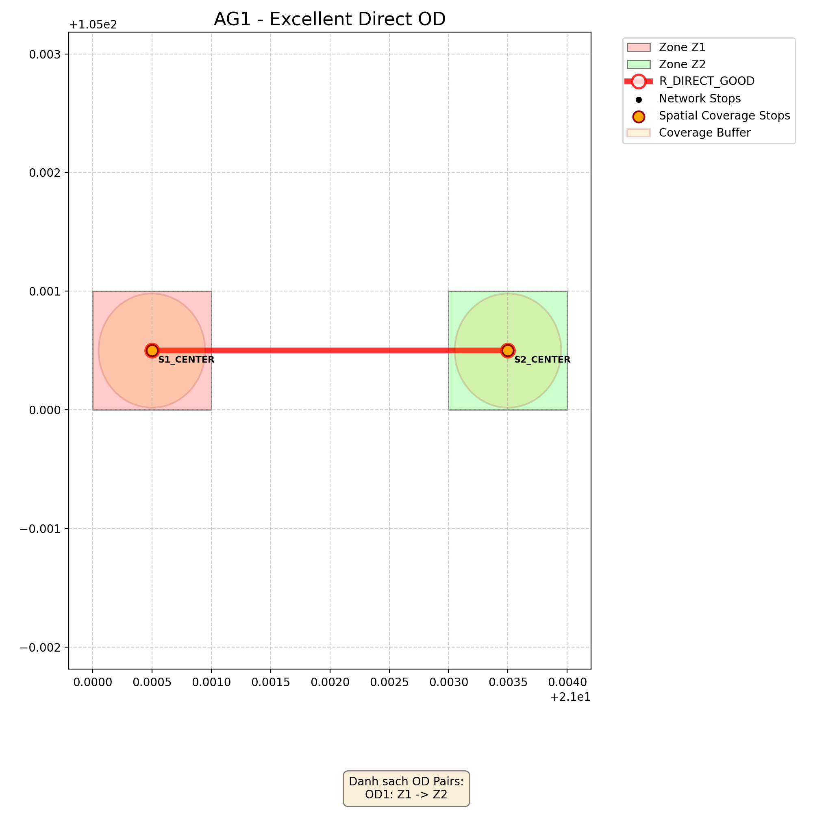
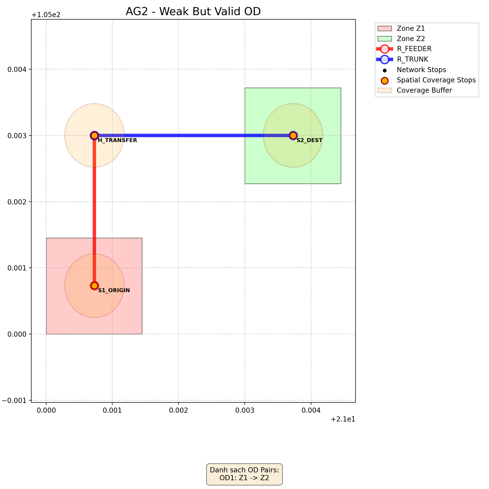
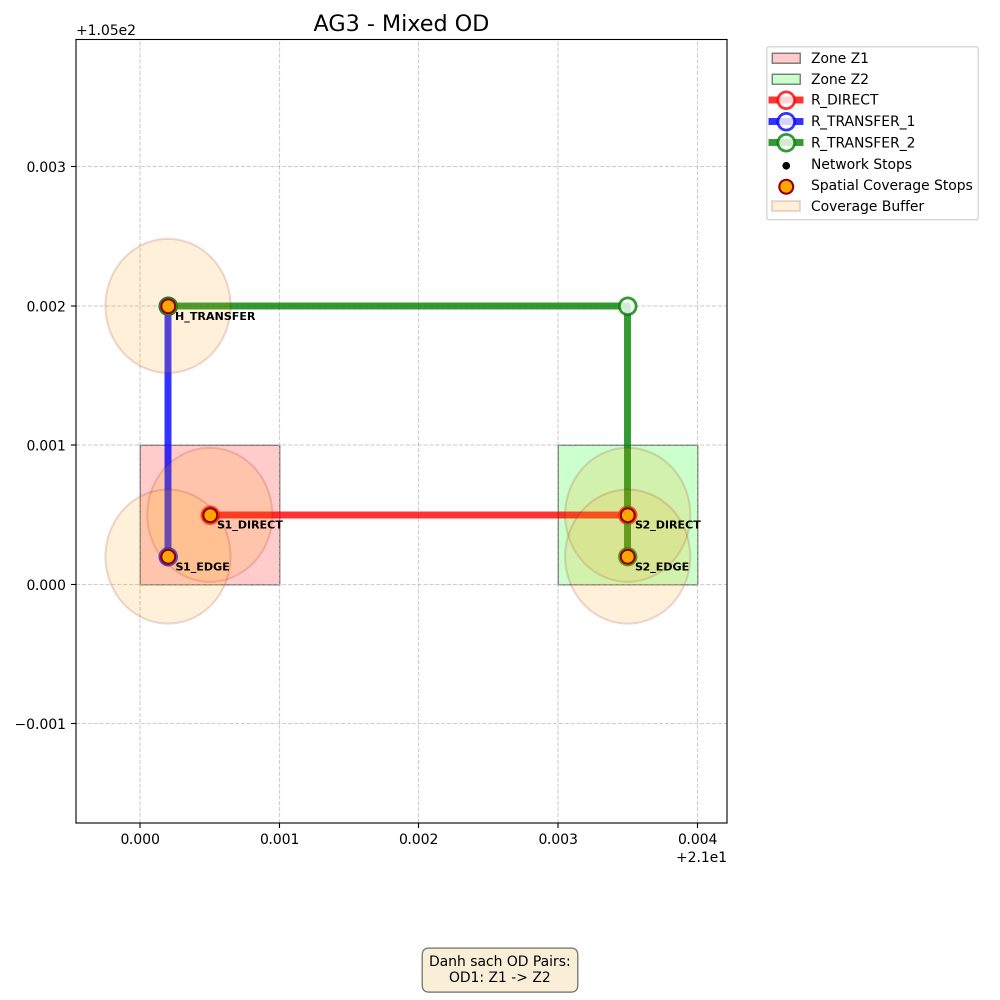
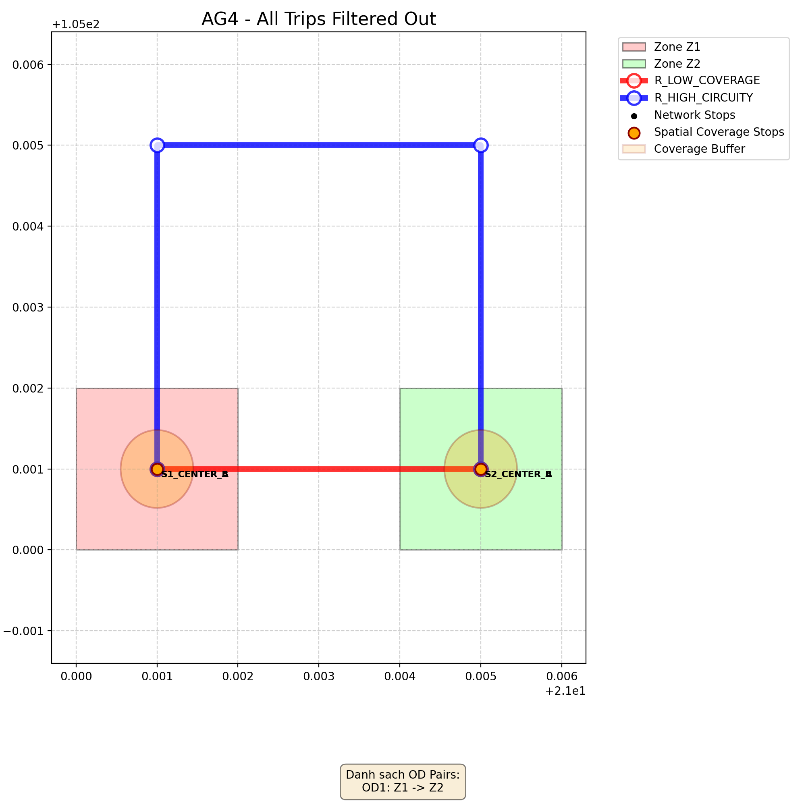
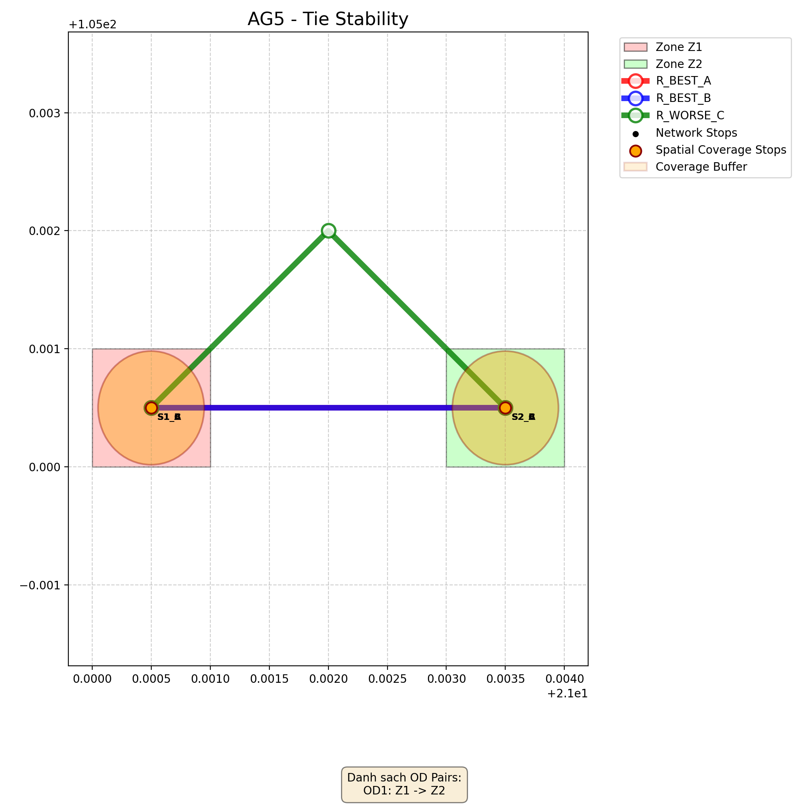

# Bao Cao Kiem Thu Aggregate KPI

## Tom Tat

Tai lieu nay mo ta bo fake repositories va ket qua kiem thu end-to-end duoc bo sung de xac thuc tinh dung dan cua hai service:

- `src/domain/service/aggregate/composite_quality_index.py`
- `src/domain/service/aggregate/od_kpi_aggregator.py`

Pham vi cua bo kiem thu nay:

- Di tron pipeline: `fake repo -> routing -> filter -> trip KPI -> composite trip -> OD aggregate`
- Su dung `ShapelyGeometryCalculator` that thay vi mock geometry
- Chi su dung `hard-threshold filtering`
- Chua trien khai `IQR outlier detection`

Tat ca so lieu ben duoi duoc lay tu test run that va lam tron den 4 chu so thap phan de de doc.

## Tong Quan Phuong Phap

### Composite Quality Index

`CompositeQualityIndexCalculator` tong hop 3 KPI cap trip:

- `Number of Transfers`
- `Circuity`
- `Service Coverage`

Quy trinh:

1. Chuan hoa KPI ve thang `0-100`, trong do diem cao hon la tot hon
2. Ap dung weighted sum

Cong thuc chuan hoa:

- `Transfer Score = 100 * (1 - T / transfer_max)`
- `Circuity Score = 100 * (circuity_max - C) / (circuity_max - 1)`
- `Coverage Score = coverage_ratio * 100`

Tham so mac dinh:

- `transfer_max = 3`
- `circuity_max = 2.5`
- Trong so:
  - `transfer = 0.45`
  - `circuity = 0.20`
  - `service_coverage = 0.35`

Cong thuc tong hop:

- `Composite Score = 0.45 * Transfer Score + 0.20 * Circuity Score + 0.35 * Coverage Score`

### OD KPI Aggregator

`ODKPIAggregator` tong hop nhieu phuong an di chuyen cua cung mot OD thanh diem dai dien cap OD.

Giai doan loc duoc su dung trong phase hien tai:

- Loai neu `transfer_raw > 1`
- Loai neu `circuity_raw > 2.5`
- Loai neu `coverage_ratio < 0.1`
- Loai neu thieu `composite score` hoac thieu normalized trip scores

Sau khi loc, service dung cung mot tap trip hop le cho ca 4 KPI OD:

- `transfer_kpi`
- `circuity_kpi`
- `spatial_coverage_kpi`
- `composite_kpi`

Phuong phap tong hop:

- `Best_Score = max(score_i)`
- `Weighted_Avg_Score = sum(w_i * score_i) / sum(w_i)`
- `OD_Score = alpha * Best_Score + (1 - alpha) * Weighted_Avg_Score`

Tham so mac dinh:

- `alpha = 0.7`

Quy tac trong so theo hang:

- Sap score giam dan
- `w_i = (N - rank_i + 1) / N`
- Neu dong diem thi dung `average rank`, de ket qua khong phu thuoc thu tu input

## Muc Tieu Kiem Thu

Bo kiem thu huong toi 5 muc tieu:

1. Kiem tra correctness cua cong thuc `Composite Quality Index`
2. Kiem tra correctness cua cong thuc `Best-Weighted Average` cap OD
3. Kiem tra tinh phan anh chat luong mang: OD tot, OD xau, OD hon hop, OD bi loai
4. Kiem tra hard-threshold filtering hoat dong dung
5. Kiem tra tie handling on dinh khi doi thu tu options

## Phuong Phap Kiem Thu

Moi case duoc chay theo pipeline that:

- `CombinedRoutingEngine`
- `MinDistanceCandidateTripFilterV2`
- `TransferRateCalculator`
- `CircuityIndexCalculator`
- `SpatialCoverageCalculator`
- `CompositeQualityIndexCalculator`
- `ODKPIAggregator`
- `ShapelyGeometryCalculator`

Lenh da chay:

1. `.\\.venv\\Scripts\\python.exe -m pytest tests/domain/service/aggregate/test_aggregate_fake_repo_cases.py -q -p no:cacheprovider`
2. `.\\.venv\\Scripts\\python.exe -m pytest tests/domain/service/aggregate -q -p no:cacheprovider`
3. `.\\.venv\\Scripts\\python.exe -m pytest tests/test_api_od_aggregation.py -q -p no:cacheprovider`
4. `.\\.venv\\Scripts\\python.exe src/adapters/repository/visualize_repo/run_aggregate_tests.py`

Ket qua quan sat:

- `test_aggregate_fake_repo_cases.py`: `6 passed`
- Toan bo `tests/domain/service/aggregate`: `15 passed`
- API smoke test: `1 passed`
- Visualize script: sinh thanh cong `5` anh minh hoa

## Cac Kich Ban Kiem Thu

### AG1 - Excellent Direct OD

- Repository: `FakeRepoAG1`
- Muc dich kiem thu:
  - Xac nhan he thong cham diem cao cho mot OD tot, di thang, it vong veo, coverage cao
- Cau truc mang:
  - 2 zone nho
  - 1 route direct
  - Stop nam gan centroid hai zone
- Hanh vi ky vong:
  - Co 1 trip hop le
  - `transfer_raw = 0`
  - `circuity_raw` xap xi `1.0`
  - `coverage_ratio` cao
  - Diem composite cap OD cao va bang trip-level vi chi co 1 option
- Hinh minh hoa:
  - 
- Ket qua thu duoc:
  - Trip duy nhat: `Composite Score = 81.1517`
  - OD-level: `Composite KPI OD = 81.1517`
  - `transfer_kpi OD = 100.0000`
  - `circuity_kpi OD = 100.0000`
- Nhan xet, danh gia:
  - PASS
  - Day la case tham chieu cho "OD tot"
  - Diem cao, cau truc don gian va khong bi that thoat qua bo loc

### AG2 - Weak But Valid OD

- Repository: `FakeRepoAG2`
- Muc dich kiem thu:
  - Kiem tra he thong van giu mot OD xau nhung hop le neu no vuot qua hard-threshold
- Cau truc mang:
  - 2 zone lon hon AG1
  - 2 route, bat buoc 1-transfer
  - Origin va destination stop o gan tam zone, nhung coverage tong the thap hon AG1
- Hanh vi ky vong:
  - Chi co 1 trip hop le
  - `transfer_raw = 1`
  - `circuity_raw > 1`
  - `coverage_ratio` thap hon AG1 nhung van `>= 0.1`
  - Diem composite thap ro ret so voi AG1
- Hinh minh hoa:
  - 
- Ket qua thu duoc:
  - Trip duy nhat: `Composite Score = 48.3952`
  - `coverage_ratio = 0.1044`
  - OD-level: `Composite KPI OD = 48.3952`
- Nhan xet, danh gia:
  - PASS
  - Case nay cho thay bo loc khong "qua tay"
  - OD co chat luong yeu nhung khong bi loai, phu hop muc tieu "weak but valid"

### AG3 - Mixed OD

- Repository: `FakeRepoAG3`
- Muc dich kiem thu:
  - Kiem tra `Best-Weighted Average` uu tien phuong an tot nhat nhung van phan anh su ton tai cua phuong an kem hon
- Cau truc mang:
  - 1 route direct tot
  - 1 cap route transfer kem hon nhung van hop le
  - Cung mot OD co 2 options
- Hanh vi ky vong:
  - Ca 2 trip deu hop le
  - Trip direct phai co diem cao hon trip transfer
  - Diem OD nam giua `best trip` va `simple average`
- Hinh minh hoa:
  - 
- Ket qua thu duoc:
  - `OPT1 Composite Score = 81.1517`
  - `OPT2 Composite Score = 43.3582`
  - `Simple Average = 62.2549`
  - `Weighted Avg Composite = 68.5538`
  - `OD Composite Score = 77.3723`
- Nhan xet, danh gia:
  - PASS
  - `OD Composite Score` khong bang trung binh don gian vi service uu tien `best option` bang `alpha = 0.7`
  - Ket qua gan voi trip tot nhat hon, dung voi y do thiet ke

### AG4 - All Trips Filtered Out

- Repository: `FakeRepoAG4`
- Muc dich kiem thu:
  - Kiem tra nhanh invalid cua `ODKPIAggregator` khi tat ca trip deu bi loai
- Cau truc mang:
  - 2 direct routes cho cung mot OD
  - `R_LOW_COVERAGE`: thang nhung coverage rat thap
  - `R_HIGH_CIRCUITY`: vong ve rat cao va coverage cung thap
- Hanh vi ky vong:
  - Trip-level composite van tinh duoc
  - Tat ca options bi loai tai OD stage
  - `aggregated_kpis.*.score = None`
- Hinh minh hoa:
  - 
- Ket qua thu duoc:
  - `OPT1`: `coverage_ratio = 0.0288` -> bi loai
  - `OPT2`: `circuity_raw = 2.8781`, `coverage_ratio = 0.0288` -> bi loai
  - Tong input: `2` trip
  - Sau loc: `0` trip
  - OD-level: `Composite KPI OD = None`
  - `reason = No valid trips after hard-threshold filtering`
- Nhan xet, danh gia:
  - PASS
  - Case nay xac nhan nhanh invalid hoat dong dung
  - He thong khong "ep" sinh diem OD khi toan bo phuong an deu khong dat nguong

### AG5 - Tie Stability

- Repository: `FakeRepoAG5`
- Muc dich kiem thu:
  - Kiem tra `average rank` khi 2 options dong diem tot nhat
  - Kiem tra ket qua khong doi neu dao thu tu input
- Cau truc mang:
  - 3 route direct
  - `R_BEST_A` va `R_BEST_B` dong diem
  - `R_WORSE_C` kem hon mot chut do circuity cao hon
- Hanh vi ky vong:
  - 3 trip hop le
  - Hai trip dau co cung diem composite
  - Diem OD nam giua `best trip` va `simple average`
  - Ket qua giu on dinh khi reverse danh sach options
- Hinh minh hoa:
  - 
- Ket qua thu duoc:
  - `OPT1 Composite Score = 81.1517`
  - `OPT2 Composite Score = 81.1517`
  - `OPT3 Composite Score = 76.1944`
  - `Simple Average = 79.4993`
  - `Weighted Avg Composite = 80.3255`
  - `OD Composite Score = 80.9038`
- Nhan xet, danh gia:
  - PASS
  - `OD Composite Score` khong bang trung binh don gian vi 2 best options duoc uu tien boi `average rank` va `alpha = 0.7`
  - Case nay xac nhan tinh on dinh cua co che tie handling

## Bang Ket Qua Chi Tiet

### Bang A - Trip-Level

| Case | OD | Option | Routes | Transfer Raw | Circuity Raw | Coverage Ratio | Transfer Score (0-100) | Circuity Score (0-100) | Coverage Score (0-100) | Composite Score | Pass Hard Threshold? | Ghi chu |
| :--- | :--- | :--- | :--- | ---: | ---: | ---: | ---: | ---: | ---: | ---: | :---: | :--- |
| AG1 | OD1 | OPT1 | R_DIRECT_GOOD | 0 | 1.0000 | 0.4615 | 100.0000 | 100.0000 | 46.1477 | 81.1517 | Yes | OD tot, direct |
| AG2 | OD1 | OPT1 | R_FEEDER + R_TRUNK | 1 | 1.3944 | 0.1044 | 66.6667 | 73.7069 | 10.4395 | 48.3952 | Yes | OD xau nhung van hop le |
| AG3 | OD1 | OPT1 | R_DIRECT | 0 | 1.0000 | 0.4615 | 100.0000 | 100.0000 | 46.1477 | 81.1517 | Yes | Lua chon tot nhat |
| AG3 | OD1 | OPT2 | R_TRANSFER_1 + R_TRANSFER_2 | 1 | 2.0244 | 0.2005 | 66.6667 | 31.7053 | 20.0489 | 43.3582 | Yes | Lua chon kem hon |
| AG4 | OD1 | OPT1 | R_LOW_COVERAGE | 0 | 1.0000 | 0.0288 | 100.0000 | 100.0000 | 2.8843 | 66.0095 | No | Bi loai do coverage < 0.1 |
| AG4 | OD1 | OPT2 | R_HIGH_CIRCUITY | 0 | 2.8781 | 0.0288 | 100.0000 | 0.0000 | 2.8843 | 46.0095 | No | Bi loai do circuity > 2.5 va coverage < 0.1 |
| AG5 | OD1 | OPT1 | R_BEST_A | 0 | 1.0000 | 0.4615 | 100.0000 | 100.0000 | 46.1477 | 81.1517 | Yes | Best tie A |
| AG5 | OD1 | OPT2 | R_BEST_B | 0 | 1.0000 | 0.4615 | 100.0000 | 100.0000 | 46.1477 | 81.1517 | Yes | Best tie B |
| AG5 | OD1 | OPT3 | R_WORSE_C | 0 | 1.3718 | 0.4615 | 100.0000 | 75.2138 | 46.1477 | 76.1944 | Yes | Lua chon thap hon |

### Bang B - OD-Level

| Case | OD | Valid Trips / Total Trips | Transfer KPI OD | Circuity KPI OD | Spatial Coverage KPI OD | Composite KPI OD | Best Composite | Weighted Avg Composite | OD Valid? | Nhan xet ngan |
| :--- | :--- | :---: | ---: | ---: | ---: | ---: | ---: | ---: | :---: | :--- |
| AG1 | OD1 | 1/1 | 100.0000 | 100.0000 | 46.1477 | 81.1517 | 81.1517 | 81.1517 | Yes | Case tham chieu OD tot |
| AG2 | OD1 | 1/1 | 66.6667 | 73.7069 | 10.4395 | 48.3952 | 48.3952 | 48.3952 | Yes | OD xau nhung van hop le |
| AG3 | OD1 | 2/2 | 96.6667 | 93.1705 | 43.5378 | 77.3723 | 81.1517 | 68.5538 | Yes | Nghieng ve best option, khong bang simple average |
| AG4 | OD1 | 0/2 | None | None | None | None | None | None | No | Tat ca trip bi loai sau filtering |
| AG5 | OD1 | 3/3 | 100.0000 | 98.7607 | 46.1477 | 80.9038 | 81.1517 | 80.3255 | Yes | Tie handling on dinh, ket qua gan best |

## Danh Gia Tong The

Bang ket qua cho thay 4 xu huong quan trong:

1. OD tot co diem cao hon OD xau
   - `AG1 Composite KPI OD = 81.1517`
   - `AG2 Composite KPI OD = 48.3952`
   - Dieu nay xac nhan `CompositeQualityIndexCalculator` va `ODKPIAggregator` phan anh dung chat luong tong the

2. OD hon hop nam giua best trip va trung binh don gian
   - `AG3`
   - `Best = 81.1517`
   - `Simple Average = 62.2549`
   - `OD = 77.3723`
   - Ket qua nam dung giua hai moc nay va nghieng ve best trip, dung voi `alpha = 0.7`

3. Case bi loc toan bo tra ve invalid dung
   - `AG4`
   - Dau vao `2` trip
   - Sau loc con `0`
   - Tat ca `aggregated_kpis.*.score = None`
   - `reason` dung voi quy uoc hien tai

4. Case dong diem giu on dinh khi doi thu tu
   - `AG5`
   - Hai trip tot nhat dong diem `81.1517`
   - `OD = 80.9038`, gan best hon simple average `79.4993`
   - Test reverse input cung giu nguyen ket qua, xac nhan `average rank` hoat dong dung

Neu nhin tong the, thu tu chat luong cap OD phu hop truc giac nghiep vu:

- `AG1 = 81.1517`
- `AG5 = 80.9038`
- `AG3 = 77.3723`
- `AG2 = 48.3952`
- `AG4 = invalid`

Thu tu nay hop ly:

- AG1 la OD direct tot nhat
- AG5 gan AG1 vi co 2 lua chon tot nhat dong diem
- AG3 thap hon AG1 vi co them 1 phuong an kem
- AG2 thap ro ret vi vua transfer vua coverage thap
- AG4 khong du dieu kien de tong hop cap OD

## Ket Luan

Bo fake repositories va bo kiem thu moi da xac nhan hai service aggregate hoat dong dung tren du lieu end-to-end:

- `CompositeQualityIndexCalculator` chuan hoa va tong hop dung theo thang `0-100`
- `ODKPIAggregator` loc dung theo hard-threshold va tong hop dung theo `Best-Weighted Average`

Nhung diem da duoc xac nhan ro:

- OD tot duoc cham diem cao hon OD xau
- OD hon hop duoc danh gia gan phuong an tot nhat hon trung binh don gian
- Case bi loai toan bo tra ve invalid dung
- Case dong diem on dinh khi doi thu tu input

Gioi han hien tai:

- Chua co `IQR outlier detection`
- Chua kiem thu mang `> 1 transfer` vi routing engine hien tai chi ho tro den `1-transfer`

De xuat phase sau:

- Bo sung `Giai doan 2 - Statistical Outlier Detection`
- Bo sung mot `master case` lon hon de test stress, benchmark va tinh on dinh tren mang phuc tap hon
