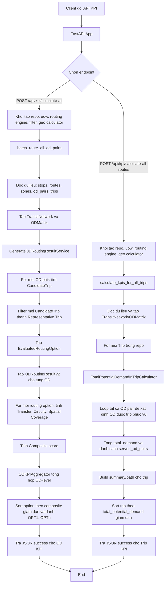
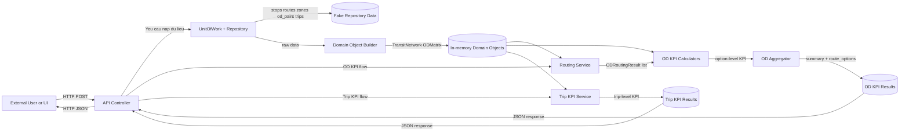
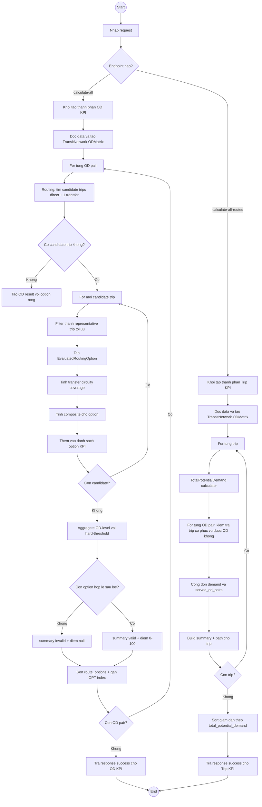

# System Flow Diagrams (Mermaid)

Tai lieu nay mo ta luong hoat dong toan bo chuong trinh KPI Evaluation Bus, gom:

1. Flowchart tong the
2. Data Flow Diagram (DFD level 1)
3. Activity Diagram chi tiet nghiep vu

---

## 1. Flowchart Tong The

### Giai thich nhanh
- He thong co 2 luong API chinh: OD-level KPI va Trip-level KPI.
- Moi luong deu bat dau tu fake repository, sau do dung domain object roi tinh KPI.
- Dau ra duoc rut gon va sort de phuc vu giao dien/API consumer.

---

## 2. Data Flow Diagram (DFD - Level 1)

### Giai thich nhanh
- P1 la entrypoint FastAPI trong src/entrypoints/api.py.
- P2-P3 la khoi tai du lieu va chuyen thanh model domain.
- P4-P6 la pipeline OD KPI.
- P7 la pipeline Trip KPI.
- D3, D4 la du lieu ket qua tra ve cho client.

---

## 3. Activity Diagram Chi Tiet

### Giai thich nhanh
- Nhanh OD KPI:
  - Routing tao cac candidate trip.
  - Filter chon representative trip toi uu theo khoang cach tiep can + khoang cach tren tuyen.
  - Tinh 3 KPI option-level: transfer, circuity, spatial coverage.
  - Composite calculator quy doi score ve thang 0-100.
  - Aggregator loc theo nguong va tong hop OD-level.

- Nhanh Trip KPI:
  - Duyet tung trip cua repository.
  - Kiem tra tung OD pair co duoc trip do phuc vu hay khong.
  - Cong don total potential demand va luu chi tiet served_od_pairs.
  - Sort trip theo demand giam dan de tra ket qua.

---

## 4. Formula va Rule Quan Trong

### 4.1 Composite score (option-level)

Y tuong tong quat:

- Transfer cang it cang tot
- Circuity cang gan 1 cang tot
- Coverage cang cao cang tot

Cong thuc:

- Composite = 0.45 * Transfer_norm + 0.20 * Circuity_norm + 0.35 * Coverage_norm

### 4.2 OD-level aggregate

- Loc hard-threshold:
  - transfer <= 1
  - circuity <= 2.5
  - spatial coverage >= 0.1

- Neu khong con option hop le:
  - summary.is_valid = false
  - summary.reason = No valid trips after hard-threshold filtering
  - scores = null

- Neu con option hop le:
  - OD_score = alpha * best + (1 - alpha) * weighted_average
  - alpha mac dinh = 0.7

---

## 5. Mapping sang Source Code

- API entrypoint: src/entrypoints/api.py
- OD orchestration: src/service_layer/service/routing_services.py
- Trip orchestration: src/service_layer/service/trip_kpi_services.py
- Routing generation: src/domain/service/generate_od_routing_result.py
- Routing engines: src/domain/service/routing.py
- Candidate filter: src/domain/service/filter.py
- KPI calculators:
  - src/domain/service/kpi_caculator/transfer_kpi.py
  - src/domain/service/kpi_caculator/circuity_kpi.py
  - src/domain/service/kpi_caculator/spatial_coverage_kpi.py
- Composite + aggregator:
  - src/domain/service/aggregate/composite_quality_index.py
  - src/domain/service/aggregate/od_kpi_aggregator.py
- Trip KPI calculator:
  - src/domain/service/trip_kpi_caculator/total_potential_demand_in_trip.py
- Data source fake repo: src/adapters/repository/fake_repo_grid_3x3.py

---

## 6. Ket Luan

- Chuong trinh duoc to chuc ro theo DDD + service layer.
- Luong tinh KPI tach biet theo OD-level va Trip-level.
- Diagram tren co the dua truc tiep vao docs ky thuat, bao cao nghiep vu, hoac onboarding dev moi.
