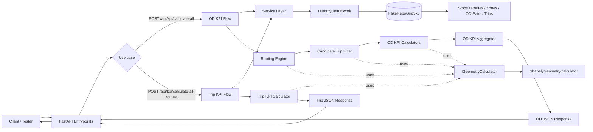
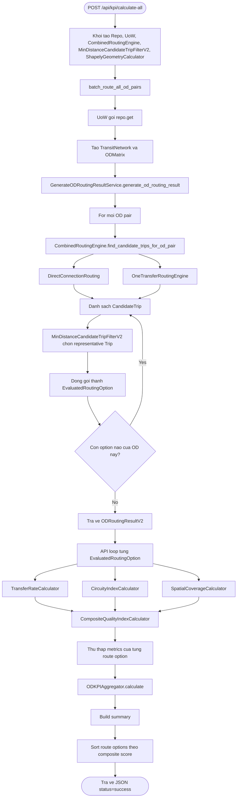
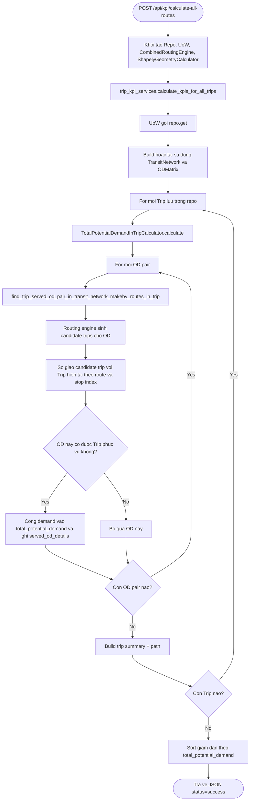
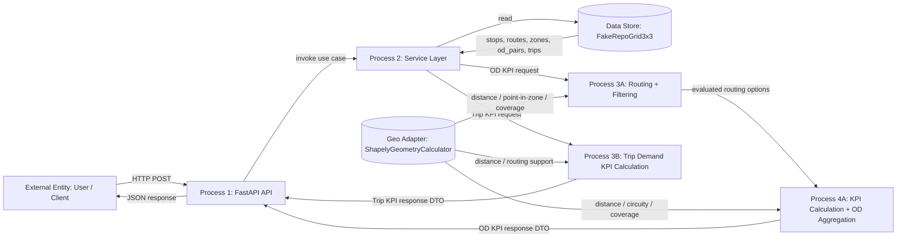
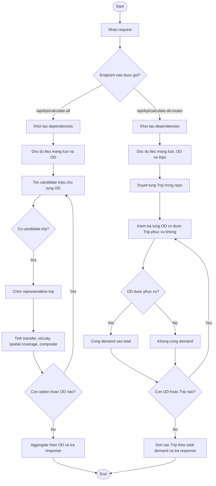

# System Flow Diagrams (Mermaid)

Tai lieu nay tom tat luong hoat dong cua toan bo chuong trinh theo code hien tai.

Luu y:
- Mermaid khong co cu phap UML Activity Diagram "chinh thong", vi vay phan Activity Diagram ben duoi duoc bieu dien bang `flowchart`.
- Runtime hien tai dang doc du lieu tu repo gia `FakeRepoGrid3x3`, chua ket noi database hay file MATSim that.

## 1. Flowchart Tong The Kien Truc

## 2. Flowchart Luong `/api/kpi/calculate-all`

## 3. Flowchart Luong `/api/kpi/calculate-all-routes`

## 4. Data Flow Diagram (DFD)

## 5. Activity Diagram Tong Quan

## 6. Giai Thich Chi Tiet Theo Tung Tang

### 6.1 Entrypoint

- `src/entrypoints/api.py` la cua vao HTTP cua he thong.
- Co 2 endpoint runtime chinh:
  - `/api/kpi/calculate-all`: tinh KPI theo tung cap OD.
  - `/api/kpi/calculate-all-routes`: tinh KPI theo tung Trip co san trong repo.
- Entrypoint chi lam 4 viec:
  - khoi tao dependency,
  - goi service layer,
  - build JSON response,
  - bat loi va tra `HTTPException`.

### 6.2 Service Layer

- `routing_services.batch_route_all_od_pairs` la use case cho OD KPI.
- `trip_kpi_services.calculate_kpis_for_all_trips` la use case cho Trip KPI.
- Day la tang dieu phoi:
  - mo `with uow`,
  - lay data tu repo,
  - build `TransitNetwork` va `ODMatrix`,
  - goi domain services phia duoi.

### 6.3 Repository va Unit Of Work

- `FakeRepoGrid3x3` cung cap du lieu mau rat nho:
  - 2 zone,
  - 5 stop,
  - 2 route,
  - 1 OD pair,
  - 2 trip da luu san.
- `DummyUnitOfWork` dang la UoW gia:
  - `commit()` chi danh dau co commit,
  - `rollback()` khong lam gi.
- Dieu nay cho thay he thong da duoc to chuc theo pattern Cosmic Python, nhung runtime hien tai van dang chay thu nghiem trong bo nho.

### 6.4 Domain Model

- `TransitNetwork` quan ly `stops` va `routes`.
- `ODMatrix` quan ly `zones` va `od_pairs`.
- `CandidateTrip` la phuong an tho, chua chot tram len/xuong.
- `Trip` la phuong an dai dien cuoi cung, da chot `board_stop_id` va `alight_stop_id`.
- `EvaluatedRoutingOption` ghep cap:
  - `candidate_trip`,
  - `representative_trip`.

### 6.5 Domain Service: Routing

- `CombinedRoutingEngine` gom 2 chien luoc:
  - `DirectConnectionRouting`: tim duong di thang, khong chuyen tuyen.
  - `OneTransferRoutingEngine`: tim duong di co 1 lan chuyen tuyen.
- Hien tai he thong chi ho tro toi da 1 lan chuyen tuyen.
- Routing tra ve `CandidateTrip`, nghia la moi chan van chi biet:
  - tap stop co the len,
  - tap stop co the xuong.

### 6.6 Domain Service: Filter

- `MinDistanceCandidateTripFilterV2` chuyen `CandidateTrip` thanh `Trip`.
- Quy tac:
  - toi uu khoang cach di bo tu centroid zone den stop len/xuong,
  - neu bang diem truy cap thi uu tien quang duong tren route ngan hon,
  - voi chuyen co transfer thi chon transfer stop giup tong quang duong tren route nho nhat.

### 6.7 KPI cho OD

- `TransferRateCalculator`
  - 0 transfer -> score raw = 0
  - 1 transfer -> score raw = 1
  - >1 transfer -> invalid
- `CircuityIndexCalculator`
  - score raw = tong chieu dai di theo route / khoang cach duong thang dau-cuoi
  - cang gan 1 cang tot
- `SpatialCoverageCalculator`
  - dung `candidate_trip`, khong dung `representative_trip`
  - lay cac stop co the len o leg dau va cac stop co the xuong o leg cuoi
  - tinh do phu cho origin zone va destination zone
  - `score_ratio = origin_coverage_ratio * destination_coverage_ratio`
- `CompositeQualityIndexCalculator`
  - chuan hoa ve thang 0-100
  - trong so mac dinh:
    - transfer: 45%
    - circuity: 20%
    - service coverage: 35%

### 6.8 Tong hop KPI theo OD

- `ODKPIAggregator` khong don gian la lay trung binh.
- No loc truoc cac option hop le bang hard-threshold:
  - transfer <= 1
  - circuity <= 2.5
  - service coverage >= 0.1
- Neu tat ca option deu bi loai:
  - summary cua OD se `is_valid = false`
  - nhung `route_options` van duoc tra ve de xem tham khao.
- Neu con option hop le:
  - lay `best_score`,
  - tinh them `weighted_average_score` theo xep hang,
  - tron theo `alpha = 0.7`.

### 6.9 KPI theo Trip

- `TotalPotentialDemandInTripCalculator` tra loi cau hoi:
  - "Trip hien tai phuc vu duoc tong bao nhieu demand OD?"
- Moi `Trip` trong repo duoc doi chieu voi tat ca `ODPair`.
- Voi moi OD:
  - routing engine sinh candidate trip co the phuc vu OD,
  - he thong cat giao candidate trip do voi `Trip` hien tai theo route va thu tu stop,
  - neu co giao hop le thi demand cua OD do duoc cong vao tong.
- Ket qua moi Trip gom:
  - `trip_id`,
  - `summary.total_potential_demand`,
  - `path`,
  - `served_od_pairs`.

## 7. Vi Du Dung Chinh Du Lieu Mau Hien Tai

### 7.1 Du lieu mau trong repo

- Zone:
  - `Z1`
  - `Z2`
- Stops:
  - `S1`, `S2`, `S3`, `S4`, `S5`
- Routes:
  - `R1: S1 -> S2 -> S3 -> S4`
  - `R2: S3 -> S5`
- OD:
  - `OD1: Z1 -> Z2`, demand = `120`
- Trips luu san:
  - `Trip([R2: S3 -> S5])`
  - `Trip([R1: S1 -> S4])`

### 7.2 Tai sao `/api/kpi/calculate-all` hien tai chi ra 1 route option?

Voi du lieu mau:
- Chi co `R1` di qua ca `Z1` va `Z2`, nen `DirectConnectionRouting` sinh duoc 1 `CandidateTrip`.
- `R2` chi nam o phia `Z2`, nen khong tao duoc phuong an hoan chinh cho OD tu `Z1` sang `Z2`.
- `OneTransferRoutingEngine` khong sinh them option vi origin side khong co route nao khac `R1` de ghep transfer.

Sau do filter chon representative trip:
- co the len o `S1` hoac `S2`,
- co the xuong o `S3` hoac `S4`,
- do centroid va vi tri stop doi xung nen chi phi di bo bang nhau,
- he thong dung tie-break bang quang duong tren route va chon `S2 -> S3`.

Vi vay output OD hien tai la:
- `route_sequence = ["R1"]`
- `stop_sequence = ["S2", "S3"]`

### 7.3 Tai sao `/api/kpi/calculate-all-routes` hien tai tra `Trip_2` dung truoc `Trip_1`?

Vi service dang:
1. gan `trip_id` theo thu tu doc tu repo,
2. sau do moi sort theo `total_potential_demand`.

Nen:
- `Trip_1` thuc ra la trip `R2: S3 -> S5`
- `Trip_2` thuc ra la trip `R1: S1 -> S4`
- sau khi sort thi `Trip_2` len truoc vi phuc vu duoc demand `120`, con `Trip_1` chi duoc `0`.

## 8. Nhung Diem Can Luu Y Khi Doc Code

- `DEFAULT_REFERENCE_PATH` hien tai chi la placeholder; `FakeRepoGrid3x3` khong su dung path nay de doc file that.
- Luong OD KPI hien tai doc repo 2 lan:
  - 1 lan trong `routing_services.batch_route_all_od_pairs`,
  - 1 lan nua trong `api.calculate_kpi_all_od_pairs`.
- Trong `find_trip_served_od_pair_in_transit_network_makeby_routes_in_trip`, comment cho thay y dinh la tao sub-network chi gom route trong `trip`, nhung implementation hien tai van dat `sub_transitnetwork = transit_network`.
  - Nghia la code that dang routing tren full network roi moi cat giao voi trip hien tai.
- Do do, khi mo rong he thong sang du lieu lon hon, day la 1 diem nen xem lai de dam bao y nghia nghiep vu khop voi implementation.

## 9. File Code Chinh Nen Doc Neu Muon Hieu Sau

- `src/entrypoints/api.py`
- `src/service_layer/service/routing_services.py`
- `src/service_layer/service/trip_kpi_services.py`
- `src/domain/service/routing.py`
- `src/domain/service/filter.py`
- `src/domain/service/generate_od_routing_result.py`
- `src/domain/service/kpi_caculator/transfer_kpi.py`
- `src/domain/service/kpi_caculator/circuity_kpi.py`
- `src/domain/service/kpi_caculator/spatial_coverage_kpi.py`
- `src/domain/service/aggregate/composite_quality_index.py`
- `src/domain/service/aggregate/od_kpi_aggregator.py`
- `src/domain/service/trip_kpi_caculator/total_potential_demand_in_trip.py`
- `src/adapters/repository/fake_repo_grid_3x3.py`
- `src/adapters/geospatial/geopy_shapely.py`
