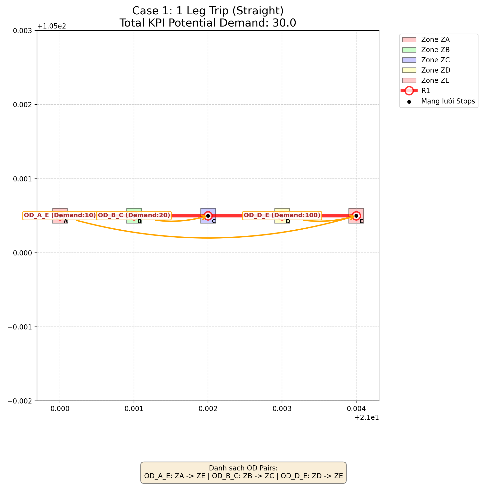
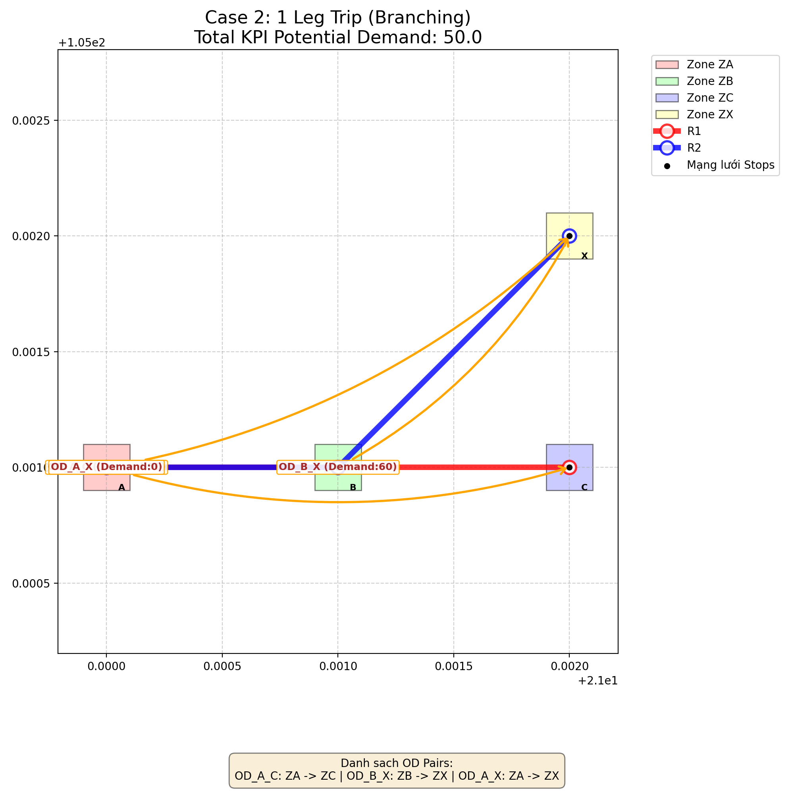
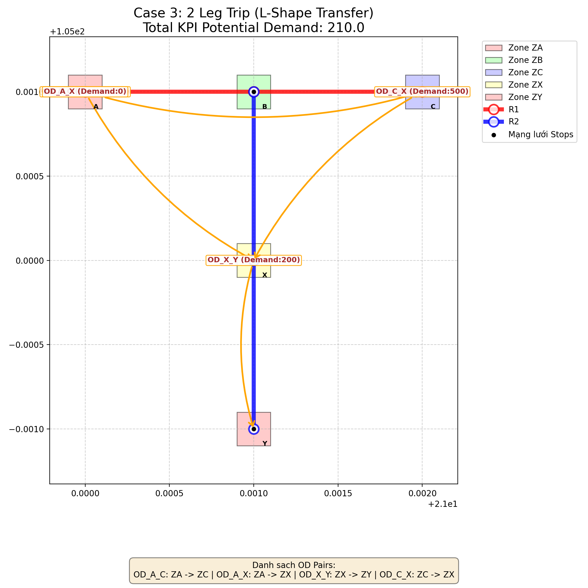
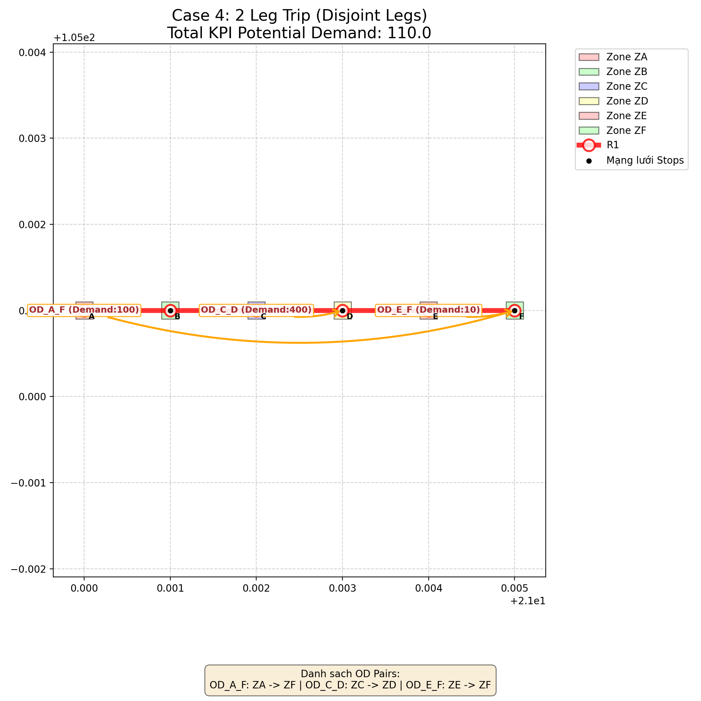

# 📊 Tài liệu Thuật toán: Trip Potential Demand KPI

Tài liệu này giải thích thuật toán tính toán lượng nhu cầu tiềm năng được phục vụ (thỏa mãn) bởi một hành trình đa chặng (Trip).

Mục tiêu chính: **Tính nhu cầu của tất cả các cặp OD có tồn tại ít nhất một kết nối (hướng đi) trên tuyến đường chồng lấn với đoạn tuyến của Trip.**

---

## 🛑 Vấn đề của cách tiếp cận dùng phép trừ Tập hợp (Cũ)
Cách tiếp cận trước đây tính toán dựa trên tập hợp OD:
- `Total`: Nhu cầu của tất cả các OD đi qua toàn bộ tuyến đường.
- `Unused`: Nhu cầu các OD chỉ sử dụng đoạn râu (đoạn trước khi khách lên ở Leg, hoặc sau khi khách xuống ở Leg).
- `Potential Demand = Total - Unused`

**Lỗi phát sinh ở đâu?**
Nếu có một Cặp OD mà điểm Origin/Destination của họ **bao hàm ngay chính điểm bắt xe trung chuyển** của hành trình Trip đó, nhóm này sẽ bị xếp nhầm vào nhóm "Unused" (Vì điểm dừng trung chuyển vẫn nằm trên đoạn đoạn râu chưa lên Trip). Hậu quả dẫn đến việc phép trừ này đã vô tình trừ luôn cả những người đang thực sự sử dụng Trip.

---

## ✅ Giải pháp: Thuật toán Kiểm tra Giao cắt Chỉ số Trạm (Mới)
Thay vì sử dụng các tập hợp trừ đi nhau, kiến trúc mới sử dụng giải thuật giao cắt Interval dựa trên chỉ số trạm (`stops_seq index`) dọc theo tuyến đường trực tiếp trong module `spatial.py` và `total_potential_demand_in_trip.py`.

### 1. Phân luồng trong `spatial.py`
Hàm `is_odpair_served_by_segment_of_route()` chịu trách nhiệm phân tích 1 cặp OD bất kỳ với 1 đoạn Leg `[S1, S2]` thuộc tuyến `Route`.

Quy trình 3 bước tường minh:
1. **Tìm Tuyến phục vụ O/D:**
   Lấy tất cả các chỉ số (index) trạm thuộc tuyến. Tìm tất cả các trạm nằm trong vùng Origin (lưu vào mảng `O_indices`), và các trạm nằm trong vùng Destination (lưu vào mảng `D_indices`).
   *(Nếu một trong 2 mảng này rỗng, chứng tỏ toàn bộ tuyến này không hề đi qua điểm đón/trả khách của OD -> Trả về `False`)*.

2. **Xác định các khoảng đi lại hợp lệ của khách `[o_idx, d_idx]`:** 
   Khách có thể lên xe tại bất kỳ trạm `o_idx` nào (trong `O_indices`) và xuống ở `d_idx` nào (trong `D_indices`) miễn là **`o_idx < d_idx`** (Đi đúng chiều theo quy định tuyến).

3. **Kiểm tra giao cắt (Intersection) với đoạn Leg:**
   Đoạn tuyến của Trip nhập vào nằm trong khoảng `[S1_idx, S2_idx]`.
   Quãng đường khách di chuyển `[o_idx, d_idx]` chỉ cần chia sẻ **ít nhất một trạm dừng (overlap >= 0 edge, chạm 1 điểm)** với đoạn Leg thì có nghĩa là OD này được tính là đã phục vụ bởi Trip đó. 
   > **Công thức toán học Giao Cắt Trạm:**
   > `max(o_idx, S1_idx) <= min(d_idx, S2_idx)`
   
   Chỉ cần 1 cặp `(o, d)` hợp lệ thoả mãn công thức trên, hệ thống đánh dấu ngay là khách đi qua Leg -> `Trả về True`.

---

### 2. Tinh gọn trong `total_potential_demand_in_trip.py`
Nhờ sự chính xác tuyệt đối từ `spatial.py`, phép tính KPI giờ đây rất đơn giản:
1. Tạo một `Set` có tên là `served_od_pairs`. Tập hợp này mang tính duy nhất, nhằm trừ hao những khách có Demand đi qua nhiều chặng (nhiều Leg) cũng không bị cộng trùng.
2. Vòng lặp duyệt qua từng `Leg` nằm trong cách đi `Trip`.
3. Nhờ `spatial` lấy tập hợp tất cả OD phục vụ trực tiếp bởi đoạn Leg đó và `update()` dồn tất cả chúng vào biến Set.
4. Tổng thu thập: Tính tổng trực tiếp `sum(od_pair.demand())` từ `served_od_pairs`. Lấy chính xác Demand không dư, không thiếu, không lo rớt khách đi trực tiếp qua điểm trung chuyển.

---

*Hệ thống hiện tại tự động đảm bảo kiểm soát tốt các luồng rẽ nhánh và sai sót định tuyến dạng biên độ*

---

## 🖼️ Kiểm chứng bằng Kịch bản (Test Cases) có hiển thị Demand OD

Các kịch bản dưới đây hiển thị rõ các mũi tên kỳ vọng luân chuyển của khách hàng. Tất cả thỏa mãn tiêu chí `overlap >= 0 edges` (chỉ cần chạm 1 trạm là tính). Những nhu cầu nằm ngoài vùng phục vụ của khung chuyến đi sẽ bị loại bỏ, dù có trùng với lộ trình tuyến xe công cộng.

### Case 1: Trip 1 Chặng - Tuyến Thẳng (1 Leg Trip)
- Trip chỉ hoạt động trên chặng giữa `[B - C]`.
- OD `A -> E` (10) và `B -> C` (20) giao cắt và chạm điểm dừng với sự phục vụ của Trip -> Demand cộng vào = 30.
- OD `D -> E` (100) mong muốn lên xe, tuy tuyến đường thì đi qua đấy, nhưng Trip thì không (Trip đã kết thúc tại C). Bị loại bỏ!

### Case 2: Trip 1 Chặng - Mạng rẽ nhánh (1 Leg Trip - Branching)
- Trip chỉ phục vụ chặng `[A - B]` của nhánh T (hoặc Y).
- Điểm C của OD `A -> C` (50) nằm trên hướng đi chuẩn, trùng điểm lên là A hoặc B. Tính = 50.
- Khách `B -> X` (60) định đón xe R2 đi xuống X. Dù xe Trip đi ngang qua B, nhưng hướng đi xe Trip hoàn toàn ko liên quan (chỉ chạy R1 thẳng). Không thỏa mãn giao thức định tuyến chung. Bị loại bỏ!

### Case 3: Trip 2 Chặng - Rẽ nối chuyến (2 Legs - Transfer Shape)
- Khách bắt đầu tại nhánh đông sang nhánh nam thông qua trạm trung chuyển `X`. Khách bắt Trip 2 chặng: Leg 1 và Leg 2.
- Nhóm khách rẽ (10, 200,...) có tiếp xúc với Leg 1 hoặc Leg 2, được quét dọn vào set không trùng lặp -> Demand được tính.
- Khách có OD `C -> X` (500) nằm tách biệt với lộ trình các chặng thực tế mà Trip chạy qua -> Demand bằng 0.

### Case 4: Trip 2 Chặng - Bị ngắt giãn cách đoạn (2 Legs - Disjoint)
- Trip phân ra làm 2 Leg rời rạc trên cùng 1 tuyến (`[A - B]` và `[E - F]`).
- Khách đi `A -> F` (100) trùng 2 đầu, tính! Trùng lặp được trừ khử an toàn.
- Khách đi lọt thỏm ngay khoảng đen nhịp nghỉ giữa 2 Leg `C -> D` (400) -> Chưa bao giờ qua mắt được thuật toán quét chạm điểm -> Demand bị loại, tính đúng = 0!

