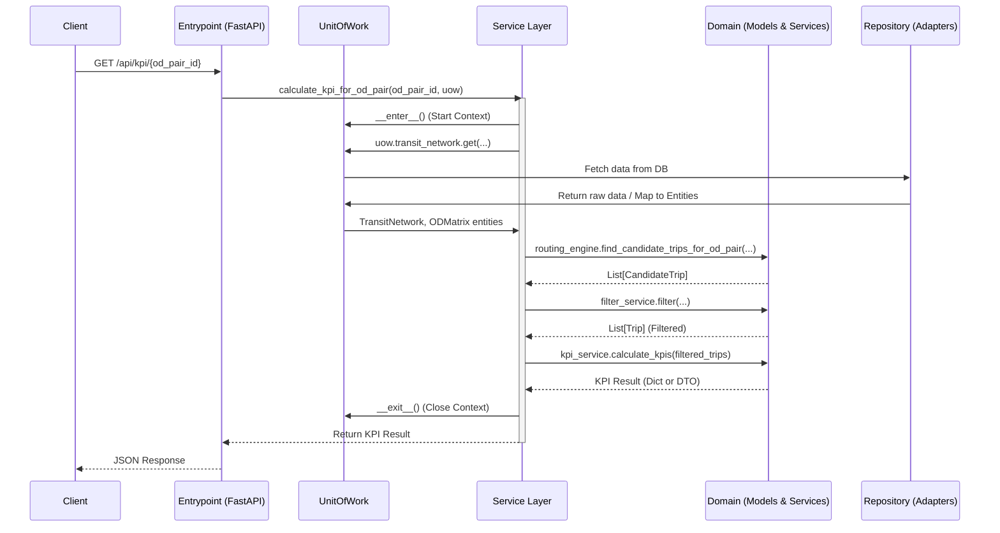

# E2E Architecture Design for KPI Evaluation System

This document outlines the proposed end-to-end flow for calculating transit route KPIs from an OD matrix, rigorously following the Domain-Driven Design (DDD) principles from the "Cosmic Python" book.

## Problem Context
The system needs to:
1. Extract traffic/OD matrix data from a database.
2. Map this data to Domain Entities.
3. Use Domain Services to calculate route KPIs.
4. Output the result in JSON format.

Currently, the project is structured with `domain`, `adapters`, and `service_layer`. However, some components (like entrypoints vs service layers, and transaction/data management) need further separation to be fully compliant with the architecture.

## Proposed End-To-End Workflow

The recommended flow separates concerns into four distinct layers:

## Recommended Architectural Improvements

To achieve this flow, here are the proposed additions and restructuring:

### 1. Introduce Entrypoints Layer
Currently, [service_layer/service/routing.py](file:///d:/CONG_VIEC_VTS/01-WORKS/03-KPIs-FOR-EVUALATING-OD-MATTRIX-DATA-AND-BUS-DATA/03-Code/KPI_Evalute_OD_Matrix_And_Transit_Network_V2/src/service_layer/service/routing.py) is acting as a FastAPI application (Entrypoint), not an application service.
*   **Action**: Create a new folder `src/entrypoints/` and move the FastAPI (e.g., `fastapi_app.py`) there.
*   **Purpose**: The entrypoint parses HTTP requests, calls the Service Layer, and formats the return back as HTTP/JSON. It should contain *zero* business logic or data fetching.

### 2. Refine the Service Layer (Application Services)
The Service Layer orchestrates the process but does not do the actual calculations.
*   **Action**: Create use-case functions in `src/service_layer/handlers.py` or `src/service_layer/kpi_services.py`.
*   **Example**: `def calculate_od_kpi(od_pair_id: str, uow: AbstractUnitOfWork) -> dict:`
*   **Responsibilities**: 
    1. Open DB connection/context (via UnitOfWork).
    2. Fetch entities from Repository.
    3. Feed entities to Domain Services (Routing, Filter, KPI Eval).
    4. Return pure data structures (dicts or DTOs) to the entrypoint.

### 3. Introduce the Unit of Work (UoW) Pattern
The "Cosmic Python" heavily relies on the Unit of Work pattern to manage data access and consistency.
*   **Action**: Create `src/service_layer/unit_of_work.py` with an `AbstractUnitOfWork` and a concrete `SqlAlchemyUnitOfWork` (or a custom Matsim UoW).
*   **Purpose**: It abstracts the database transaction management and provides the repositories to the service layer. While this project might be largely read-only for now, UoW is a great convention to manage connection lifetimes cleanly (e.g., closing DB connections after the service is done).

### 4. Separate Repositories for Bounded Contexts
Currently, `AbstractRepository` has a single `get` method returning a massive Tuple `Tuple[list[Stop], list[Route], list[Zone], ... ]`.
*   **Action**: Break this down. An Aggregate deserves its own repository.
*   **Example**: `ODMatrixRepository`, `TransitNetworkRepository`.
*   **Purpose**: Prevents loading the *entire* database into memory if you only need a specific OD Pair and nearby network. (Unless your network is small and meant to be loaded entirely).

### 5. Domain Service for KPI Calculation
You have routing and filtering services. The final step is calculating KPIs.
*   **Action**: Create `src/domain/service/kpi_calculator.py`. 
*   **Purpose**: After trips are routed and filtered, this service receives `List[Trip]` and calculates metrics (e.g., Transfer Rate, Circuitry Index) without needing to know *how* they were fetched or routed.

## User Review Required
Does this high-level workflow align with your goals for the system? 

Key decisions to confirm:
1.  **Do you want to implement the Unit of Work pattern** for managing database connections (even if it's read-only for now)?
2.  **Are you open to separating the `Entrypoint` (FastAPI) from the `Service Layer` (Application Logic)?**
3.  **Would you like to start implementing this step-by-step**, starting with mapping the Adapters or refining the Service Layer?
